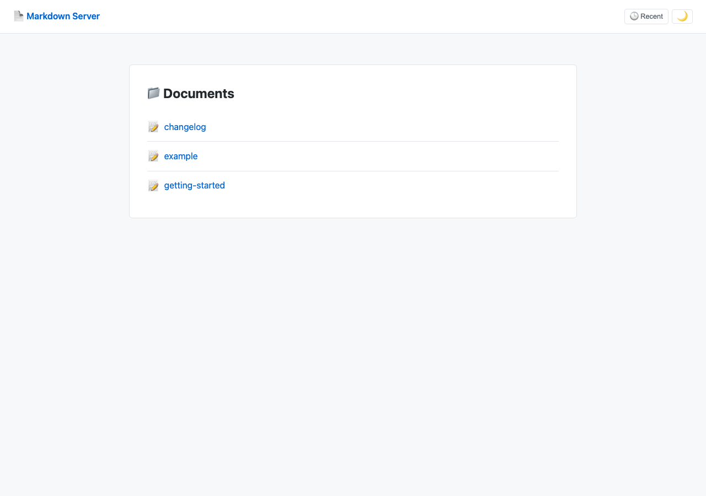
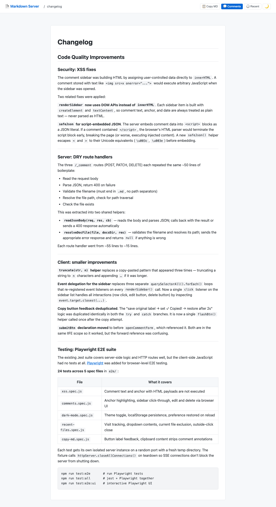

# Architecture

## Overview

Markdown Server is a zero-dependency Node.js HTTP server that renders `.md` files from a local directory. There is no framework, no build step, and no bundler — everything runs from a single file (`server.js`).





---

## Request lifecycle

```
Browser
  │
  ├─ GET /               → list .md files in docs/
  ├─ GET /<file>.md      → parse comments → strip comments → marked → renderPage
  ├─ GET /_sse           → add to sseClients set, keep connection open
  ├─ POST /_comment      → insertComment → write file → chokidar fires → SSE reload
  ├─ PATCH /_comment     → editComment  → write file → chokidar fires → SSE reload
  └─ DELETE /_comment    → deleteComment → write file → chokidar fires → SSE reload
```

File changes (from the browser or any external editor) are detected by **chokidar**, which calls `notifyClients()`. Every open browser tab has an `EventSource` connected to `/_sse`; on receiving `data: reload` it calls `window.location.reload()`.

---

## Server-side modules

Everything lives in `server.js`. Functions are grouped by concern:

### Comment helpers

| Function | Input → Output |
|---|---|
| `parseComments(raw)` | Raw markdown string → array of comment objects |
| `stripComments(raw)` | Raw markdown string → clean markdown (comment tags removed) |
| `cleanPosToRawPos(raw, cleanPos)` | Offset in stripped text → offset in raw text |
| `insertComment(raw, anchor, text, before, after)` | Inserts a `<!-- @comment: {...} -->` tag after the anchor |
| `editComment(raw, id, newText)` | Updates `text` field of the matching comment tag |
| `deleteComment(raw, id)` | Removes the matching comment tag |

Comments are stored directly in the markdown file as HTML comments, invisible to renderers but preserved on disk:

```
Some text
```

The `before`/`after` fields provide 30-character context around the anchor to disambiguate duplicate words (e.g. two uses of "server" in the same document).

### Route helpers

| Function | Purpose |
|---|---|
| `readJsonBody(req, res, cb)` | Reads the request body, parses JSON, auto-sends 400 on failure |
| `resolveDocFile(file, docsDir, res)` | Validates filename safety and resolves path, auto-sends 400/403/404 |

### Page renderer

`renderPage(title, bodyHtml, pageData?)` returns a complete HTML document as a string. When `pageData` is provided (document pages only) it injects:

- The comment list as `safeJson(comments)` — a `<script>`-safe JSON literal with `<`/`>` escaped
- The filename for API calls
- The raw markdown for the Copy MD button

`safeJson()` is a thin wrapper around `JSON.stringify` that escapes `<` → `\u003c` and `>` → `\u003e` to prevent `</script>` inside comment text from terminating the script block.

---

## Client-side architecture

All client JS is embedded inside `renderPage` as template literals — no separate JS files, no bundler.

### Two script blocks

**Block 1** (always present): SSE live-reload, dark mode toggle, recent files dropdown, copy-MD button.

**Block 2** (document pages only): comment highlighting, sidebar, selection bubble, comment form.

### Comment rendering pipeline

```
COMMENTS (from server JSON)
  │
  ├─ highlightComments()
  │    builds nodeMap (TreeWalker over .markdown-body)
  │    searches fullText for before+anchor+after context
  │    wraps matched range in <span class="comment-anchor">
  │
  └─ renderSidebar()
       for each comment: createElement + textContent  ← XSS-safe, no innerHTML
       one delegated click listener on sidebarList
```

### XSS safety

User-controlled data (comment text, anchor, date) is set via `textContent` only — never `innerHTML`. The JSON embedded in the `<script>` block uses `safeJson()` to prevent HTML parser injection.

### Selection → comment flow

```
mouseup on .markdown-body
  → getSelectionContext() extracts ±30 chars before/after
  → pendingAnchor = { text, before, after }
  → show #comment-bubble

bubble click
  → openCommentForm(anchor, undefined, before, after)
  → POST /_comment on submit
  → page reloads via SSE (chokidar detects file change)
```

---

## File watcher

`chokidar` watches `DOCS_DIR`. On local filesystems it uses native OS events (FSEvents on macOS, inotify on Linux). On networked drives (NFS, SMB) inotify events are not delivered — set `USE_POLLING=true` to switch to stat-based polling.

---

## Testing

Two test suites, kept completely separate:

| Suite | Runner | Location | Covers |
|---|---|---|---|
| Unit + integration | Jest | `__tests__/` | All server functions, HTTP routes, CommonMark conformance |
| E2E browser | Playwright | `e2e/` | XSS safety, comment UI, dark mode, recent files, clipboard |

Playwright tests use a shared fixture (`e2e/fixtures.js`) that spins up a real HTTP server on a random port with an isolated `docsDir` per test. `closeAllConnections()` is called on teardown to prevent SSE connections from blocking shutdown.

```bash
npm test              # jest only
npm run test:e2e      # playwright only
npm run test:all      # both
```
